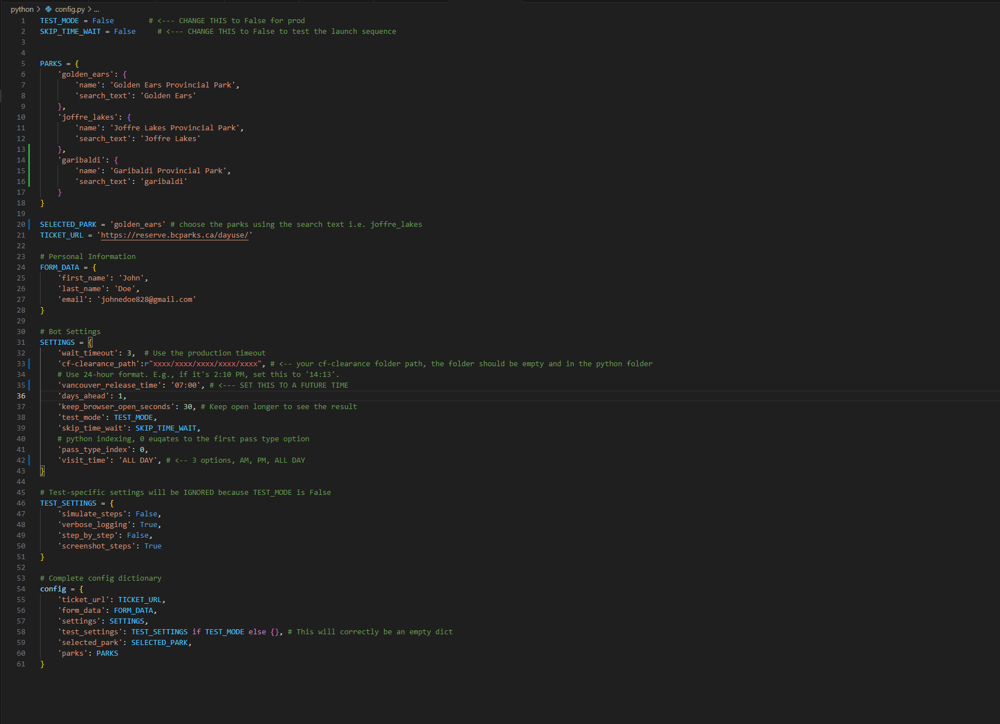

# BC Parks Day-Use Pass Automation Script

## Introduction

This is a Python-based automation script designed to assist in the process of booking day-use passes for select BC Parks via the official `reserve.bcparks.ca` website. The script uses Selenium and `undetected-chromedriver` to navigate the website in a manner that mimics human behavior, with the goal of improving the user's chances during high-demand booking periods.

This tool was developed as an educational project to explore web automation, browser control, and strategies for interacting with sophisticated web security systems like Cloudflare.

---

## ⚠️ Disclaimer and Terms of Use

**This script is provided for educational use only.**

The use of this software is at your own risk. The author and any contributors are not responsible for any consequences that may arise from its use, including but not limited to:

* **Account Suspension or Ban:** Automating interactions with websites may be against their Terms of Service. Use of this script could potentially lead to your account or IP address being suspended or permanently banned from the BC Parks reservation system.
* **Missed Bookings:** This script is not guaranteed to secure a pass. It may fail due to website changes, updates to security measures, network issues, or other unforeseen errors. The author is not responsible for any missed opportunities or failed booking attempts.
* **Legal Consequences:** You are solely responsible for ensuring that your use of this script complies with all applicable laws and the website's Terms of Service.

By using this software, you acknowledge that you have read and understood this disclaimer and agree to assume all risks associated with its use. The author provides no warranty and accepts no liability.

---

## Project Goal

The primary goal of this script is to bypass Cloudflare's bot detection **passively**. The key challenge is not to solve the "Verify you are human" checkbox challenge, but to prevent it from ever appearing.

If the Cloudflare checkbox appears while the bot is running, it signifies that Cloudflare's security has already suspected automation. At this point, even a manual click on the checkbox will result in an error, as the session has been flagged. Therefore, the entire strategy revolves around making the bot's behavior so natural and human-like that it builds enough trust with the server to avoid triggering any challenges in the first place.

## Understanding Cloudflare's Behavior

The strategy of this script is dictated entirely by how Cloudflare specifically protects the BC Parks website. Understanding this behavior is key to understanding why the script works the way it does.

### The Ideal Scenario: The Passive Check

When a regular user navigates the booking site, they may briefly see a Cloudflare pop-up box that says **"Verifying..."** and almost immediately changes to **"Success!"**. This is a passive, invisible check that happens without requiring any user interaction. Cloudflare is confident the user is human, and the process is seamless. **This is the state the script aims to maintain.**

### The Failure Scenario: The Active Challenge

If Cloudflare detects suspicious activity—such as the rapid, predictable actions of a simple bot—it escalates its defense. Instead of a passive check, it will present an active challenge: the **"Verify you are human" checkbox**.

This is the most critical point:

> **The moment the checkbox appears, the session is already lost.**

Cloudflare has already flagged the session as a bot. Even if a human manually takes over and clicks the checkbox, the verification will fail. The session is effectively **"burned,"** and it's impossible to proceed with the booking.

Therefore, the entire strategy of this project is **challenge avoidance**, not challenge solving. The "Key Features" below are all designed to build enough trust with Cloudflare's servers to be treated as a human, ensuring that only the passive, invisible check ever occurs.

---
## Key Features

* **Stealth Automation:** Utilizes `undetected-chromedriver` to avoid basic bot detection.
* **Persistent Profile:** Creates a persistent browser profile (`cf-clearance`) to build trust with the website and appear as a returning user.
* **Human-like Behavior:** Implements randomized delays and mouse movements to mimic human interaction patterns.
* **Strategic Workflow:** Employs a "Warm-Up, Stage, and Launch" strategy to maximize stealth before the ticket release and speed during the booking race.
* **Configurable:** All major settings, including park selection, personal details, and timing, are managed in a central `config.py` file.

## Prerequisites

* Python 3.8+
* Google Chrome browser installed
* `pip` for installing Python packages

## Installation & Setup

1.  **Clone the Repository:**
    ```bash
    git clone https://github.com/danieljingtailiu/bc-parks-ticket-fetch
    cd https://github.com/danieljingtailiu/bc-parks-ticket-fetch
    ```

2.  **Set up a Virtual Environment (Recommended):**
    ```bash
    python -m venv .venv
    # On Windows
    .venv\Scripts\activate
    # On macOS/Linux
    source .venv/bin/activate
    ```

3.  **Install Dependencies:**
    This project relies on two utility files, `date_utils.py` and `form_utils.py`, which should be in the same directory. The main script also requires several Python packages. Install them using:
    ```bash
    pip install -r requirements.txt 
    ```
    *(Note: You will need to create a `requirements.txt` file containing `selenium`, `pytz`, `undetected-chromedriver`, etc.)*

4.  **Create the Browser Profile Directory (IMPORTANT):**
    You must manually create a folder named `cf-clearance` inside the `python` directory.
    
    **What this folder does:** This folder stores the persistent browser profile (cookies, session data, etc.). Using a persistent profile is a critical part of the stealth strategy, as it makes the bot appear as a trusted, returning user to the website's security systems. The script will read from and write to this folder, but it will not create it automatically.

5.  **Configure the Bot:**
    * Open the `config.py` file.
    * Fill in your personal details in the `FORM_DATA` dictionary.
    * Set the `SELECTED_PARK` to your desired park.
    * Review all settings under `SETTINGS` and `TEST_SETTINGS` to match your needs.

    Default Settings
    

## Usage

### Realistic Production Test
This is the recommended way to ensure the bot is working correctly before the actual release day.

1.  **Perform the Recovery Protocol:** Delete the `cf-clearance` folder and restart your router to get a new IP address.
2.  **Set up `config.py`:**
    * Set `TEST_MODE = False` and `SKIP_TIME_WAIT = False`.
    * Set `'vancouver_release_time'` to a time 2-3 minutes in the future (e.g., if it's 2:10 PM, set it to `'14:13'`).
3.  **Run the script:**
    ```bash
    python main.py
    ```
    The bot will perform the full warm-up and launch sequence.

### Production Run

1.  Make sure your `config.py` has `TEST_MODE = False` and `SKIP_TIME_WAIT = False`.
2.  Ensure `'vancouver_release_time'` is set to the official time (e.g., `'07:00'`).
3.  Run the script before the release time.

### Development Testing
To test individual functions without waiting or running the full stealth sequence:
1.  In `config.py`, set `TEST_MODE = True` and `SKIP_TIME_WAIT = True`.
2.  Optionally, set `step_by_step = True` in `TEST_SETTINGS` to pause the script after each action.
3.  Run the script.

## Best Practices

* **Recovery Protocol:** If a run is ever blocked by Cloudflare (e.g., a pop-up appears), you must perform the recovery protocol: delete the `cf-clearance` folder and restart your router to change your IP.
* **Don't Delete After Success:** A successful run makes your profile "trusted." Do not delete the `cf-clearance` folder after a successful booking.
* **Avoid VPNs:** Commercial VPNs often use IP addresses with low trust scores, which can make it harder to bypass detection. It is recommended to use your home IP address.

---

## License

This project is licensed under the MIT License. See the `LICENSE` file for details.
